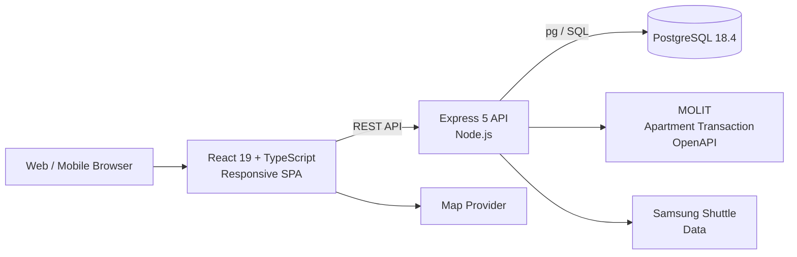
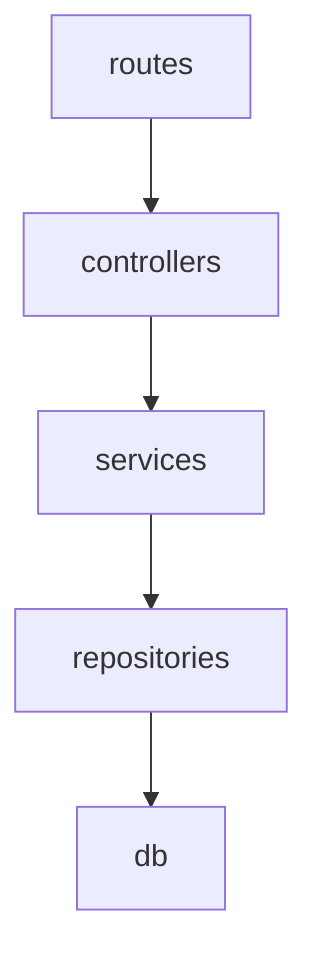
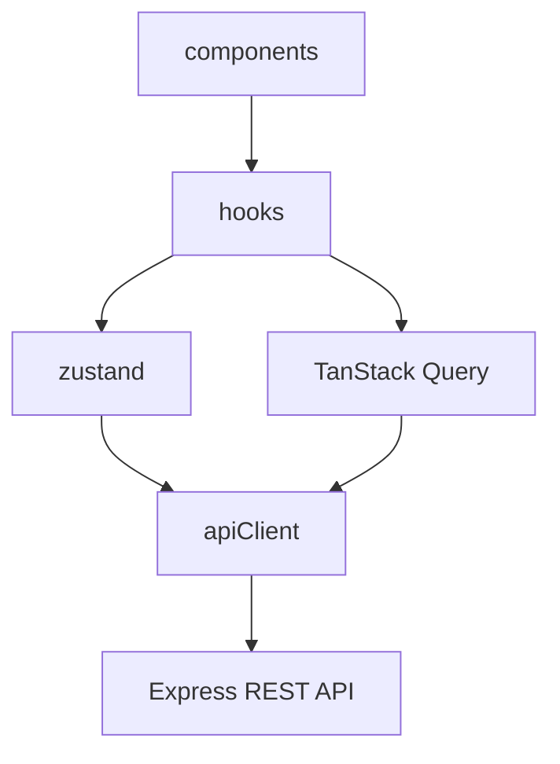

# Housing

수도권 아파트 매수 후보를 탐색하고, 실제 구매 가능성과 입지 조건을 함께 비교하기 위한 개인용 반응형 웹 애플리케이션입니다.

단순 시세 조회가 아니라 다음 질문에 답하는 것을 목표로 합니다.

> 이 아파트가 조건에 맞는가?  
> 실제로 대출을 받아 구매할 수 있는가?  
> 직장 통근, 규제, 입지, 리모델링 등을 고려했을 때 다른 후보보다 나은가?

현재 서비스는 인증 없는 단일 사용자 구조이며, React SPA와 Express API 서버, PostgreSQL로 구성됩니다.

---

## 주요 기능

### 1. 지도 기반 아파트 탐색

아파트 매물과 단지를 지도 및 목록에서 탐색할 수 있습니다.

주요 비교 정보는 다음과 같습니다.

* 매매가
* 전용면적
* 준공년도 및 연식
* 삼성전자 화성/평택 캠퍼스 셔틀 접근성
* 셔틀 통근시간
* 단지 기본정보
* 입지 정보

지도 UI는 네이버지도 기반으로 설계되어 있으며, API 이용 조건에 따라 다른 지도 서비스로 교체할 수 있도록 고려하고 있습니다.

---

### 2. 단지 및 매물 즐겨찾기

아파트 단지와 개별 매물을 서로 독립적으로 즐겨찾기에 저장할 수 있습니다.

```text
단지 즐겨찾기
≠
매물 즐겨찾기
```

특정 단지를 즐겨찾기하더라도 해당 단지의 모든 매물이 자동으로 저장되지는 않습니다.

---

### 3. 후보 비교

2개에서 최대 5개의 후보를 하나의 비교셋에서 비교할 수 있습니다.

비교 방식은 두 가지입니다.

#### 단지 비교

서로 다른 아파트 단지를 비교합니다.

주요 비교 항목:

* 연식
* 리모델링 추진 현황
* 재건축 추진 현황
* 주변 재개발 정보
* 단지 시세
* 교통
* 상권
* 학군
* 강남 접근성
* 공원 및 유흥시설
* 셔틀 통근시간
* 개발 호재
* 주변 주요 일자리

#### 매물 비교

개별 매물의 다음 정보를 비교합니다.

* 매매가
* 전용면적
* 소속 단지 정보
* 입지 조건
* 셔틀 접근성
* 대출 및 규제 관련 정보

동일 단지 내 서로 다른 매물도 비교할 수 있습니다.

---

### 4. 규제 및 대출 가능금액 분석

매물 가격과 해당 단지의 규제지역 정보를 바탕으로 구매 가능성을 분석합니다.

주요 항목:

* 토지거래허가구역 여부
* 투기과열지구 / 조정대상지역 여부
* LTV 적용
* 최대 대출 가능금액
* 갭투자 가능 여부
* 실거주 의무 여부

정책 데이터의 최신성이 확인되지 않은 경우에는 이를 확정값으로 표시하지 않고 별도 상태로 구분하도록 설계합니다.

---

### 5. 대출 시뮬레이션

사용자의 재무 정보를 이용해 실제 매수 가능성을 계산합니다.

입력 정보 예시:

* 소득
* 성과금
* 보유 자본
* 명의 구성
* 주택 보유 여부

매물별로 다음 시나리오를 비교합니다.

```text
부부합산 명의
vs
단독 명의
```

각 시나리오에 대해:

* 최대 대출가능금액
* 10년 상환액
* 20년 상환액
* 30년 상환액

등을 계산합니다.

계산 로직은 Backend service 계층에 위치하며 LTV, DSR, PMT 등의 도메인 로직과 데이터 접근 코드를 분리합니다.

---

### 6. 입지 분석

아파트가 속한 단지를 기준으로 다양한 입지 정보를 제공합니다.

예정 또는 지원 대상 데이터:

* 지하철
* 광역버스
* 시내버스
* 상권
* 학교
* 학원가
* 강남 접근성
* 공원
* 유흥시설
* 개발 호재
* 주변 대기업 및 주요 일자리

실제 데이터는 가능한 경우 공공데이터를 우선 사용합니다.

---

### 7. 리모델링 정보

리모델링 추진 중인 아파트 단지의 상태를 별도 데이터로 관리합니다.

관련 구현:

```text
backend/data/remodeling-seed.json
backend/scripts/refresh-remodeling-data.js
docs/remodeling/implementation-plan.md
```

리모델링 데이터는 추진 단계와 조사 시점을 함께 관리하여 시간이 지나면서 정보가 오래되는 문제를 줄이는 방향으로 설계되어 있습니다.

데이터는 조회와 실제 반영을 분리합니다.

```bash
npm run remodeling:list
```

```bash
npm run remodeling:apply
```

---

### 8. 아파트 실거래가 이력

국토교통부 아파트 실거래가 공개시스템 OpenAPI 데이터를 이용하여 단지 단위 가격 변동을 조회합니다.

목표 조회 기간은 최대 20년입니다.

데이터가 20년보다 짧은 경우 실제 최초 거래 시점부터 표시하고, 거래 데이터가 존재하지 않는 경우 별도의 정상 상태로 처리합니다.

---

## System Architecture



현재 구조는 개인용 단일 사용자 서비스에 맞춰 의도적으로 단순하게 유지합니다.

별도의 마이크로서비스, 메시지 큐, 캐시 서버 등은 사용하지 않습니다.

---

# Tech Stack

## Frontend

| Category | Technology |
|---|---|
| UI | React |
| Language | TypeScript |
| Build Tool | Vite |
| Routing | React Router |
| Server State | TanStack Query |
| Client State | Zustand |
| Test | Vitest |
| UI Test | Testing Library |
| Lint | ESLint |

주요 패키지:

```text
React
React Router DOM
TanStack React Query
Zustand
Vite
Vitest
Testing Library
```

---

## Backend

| Category | Technology |
|---|---|
| Runtime | Node.js |
| API | Express 5 |
| Database Driver | pg |
| Migration | node-pg-migrate |
| XML Parsing | fast-xml-parser |
| API Documentation | Swagger UI |
| Test | Jest |
| API Test | Supertest |

국토교통부 등 일부 공공 OpenAPI가 XML을 반환할 수 있기 때문에 `fast-xml-parser`를 사용합니다.

---

## Database

```text
PostgreSQL 18.4
```

DB 스키마:

```text
database/schema.sql
```

Migration은 `node-pg-migrate` 기반으로 관리합니다.

---

# Backend Architecture

Backend는 다음 단방향 의존 구조를 사용합니다.



각 계층의 역할은 명확하게 분리합니다.

### routes

URL과 Controller를 연결합니다.

비즈니스 로직은 두지 않습니다.

### controllers

HTTP 요청을 해석하고 응답 형태를 구성합니다.

### services

도메인 로직을 담당합니다.

예:

```text
LTV
DSR
PMT
규제지역 판단
대출 시뮬레이션
```

### repositories

PostgreSQL 접근과 SQL을 담당합니다.

SQL은 가능한 한 Repository 계층에 격리합니다.

### db

Connection Pool과 DB 연결을 관리합니다.

---

# Frontend Architecture



### Components

UI와 화면 렌더링을 담당합니다.

### Hooks

화면에 필요한 상태 및 API 로직을 조합합니다.

### Zustand

서버와 무관한 클라이언트 상태를 관리합니다.

예:

```text
필터 UI
비교 대상 선택
화면 상태
```

### TanStack Query

서버 데이터를 관리합니다.

예:

```text
매물
단지
즐겨찾기
실거래가
대출 계산 결과
```

### API Client

HTTP 호출을 한 곳에서 관리합니다.

---

# Project Structure

```text
housing/
│
├── backend/
│   ├── data/
│   │   └── remodeling-seed.json
│   │
│   ├── scripts/
│   │   ├── collect-regional-transactions.js
│   │   ├── refresh-remodeling-data.js
│   │   └── seed-elementary-schools.js
│   │
│   ├── src/
│   │   ├── app.js
│   │   └── index.js
│   │
│   ├── swagger/
│   │   └── swagger.json
│   │
│   ├── .env.example
│   └── package.json
│
├── frontend/
│   ├── public/
│   │   └── favicon.ico
│   │
│   ├── src/
│   │   └── main.tsx
│   │
│   ├── .env.example
│   ├── package.json
│   ├── vite.config.ts
│   └── vitest.config.ts
│
├── database/
│   └── schema.sql
│
├── docs/
│   ├── 1-domain-definition.md
│   ├── 2-prd.md
│   ├── 3-user-scenario.md
│   ├── 4-project-principle.md
│   ├── 5-arch-diagram.md
│   ├── 6-erd.md
│   ├── 7-execution-plan.md
│   ├── 8-wireframe.md
│   ├── 9-style-guide.md
│   ├── 10-api-test-report.md
│   ├── remodeling/
│   │   └── implementation-plan.md
│   └── search-architecture-refactor-plan.md
│
├── .claude/
├── .codex/
├── .opencode/
│
├── CLAUDE.md
├── .mcp.json
├── opencode.json
└── .gitignore
```

`node_modules`, build 결과물 및 coverage 파일은 위 구조에서 생략했습니다.

---

# Installation

## Requirements

다음 소프트웨어가 필요합니다.

```text
Node.js
npm
PostgreSQL
```

Windows PowerShell에서는 ExecutionPolicy를 변경하지 않고 npm 실행 파일을 직접 호출합니다.

```text
npm → npm.cmd
npx → npx.cmd
```

---

## Repository Clone

```bash
git clone https://github.com/mymelodeee/housing.git
cd housing
```

---

# Backend Setup

```bash
cd backend
npm install
```

환경변수 파일을 생성합니다.

Git Bash:

```bash
cp .env.example .env
```

Backend 실행:

```bash
npm run dev
```

개발 서버를 실행하기 전에 port 3000의 점유 프로세스와 실행 경로를 확인합니다. 이전 실행에서 남은 이 저장소의 서버인 경우에만 종료한 뒤 최신 코드로 다시 실행하고, 다른 프로세스가 사용 중이면 종료하지 않고 충돌을 먼저 해결합니다.

```powershell
Get-NetTCPConnection -LocalPort 3000 -State Listen
Get-CimInstance Win32_Process -Filter "ProcessId = <OwningProcess>"
```

재기동 후 `http://localhost:3000/health`가 정상 응답하는지 확인합니다.

일반 실행:

```bash
npm start
```

개발 모드에서는 Node.js의 watch 기능을 사용합니다.

---

# Frontend Setup

새 터미널에서:

```bash
cd frontend
npm install
```

환경변수를 생성합니다.

```bash
cp .env.example .env
```

개발 서버 실행:

```bash
npm run dev
```

기본 개발 서버:

```text
http://localhost:5173
```

---

# Build

Frontend production build:

```bash
cd frontend
npm run build
```

Build 결과는 다음 디렉터리에 생성됩니다.

```text
frontend/dist/
```

Preview:

```bash
npm run preview
```

---

# Database

DB 연결 정보는 Backend 환경변수로 설정합니다.

Migration:

```bash
cd backend
npm run migrate
```

Migration 실행 시 다음 환경변수를 사용합니다.

```text
POSTGRES_CONNECTION_STRING
```

초기 데이터베이스 구조는 다음 파일에서도 확인할 수 있습니다.

```text
database/schema.sql
```

---

# Data Collection & Maintenance

## 지역 실거래 데이터 수집

```bash
cd backend
npm run collect-transactions
```

실제 실행 스크립트:

```text
backend/scripts/collect-regional-transactions.js
```

---

## 리모델링 데이터 확인

```bash
npm run remodeling:list
```

## 리모델링 데이터 반영

```bash
npm run remodeling:apply
```

관련 스크립트:

```text
backend/scripts/refresh-remodeling-data.js
```

---

## 초등학교 데이터 Seed

```bash
node scripts/seed-elementary-schools.js
```

---

# Testing

## Frontend

전체 테스트:

```bash
cd frontend
npm test
```

Coverage:

```bash
npm run test:coverage
```

TypeScript 검사:

```bash
npm run typecheck
```

Lint:

```bash
npm run lint
```

---

## Backend

```bash
cd backend
npm test
```

Backend 테스트는 Jest와 Supertest를 사용합니다.

현재 Jest 설정은 전체 line coverage가 최소 다음 기준을 만족하도록 설정되어 있습니다.

```text
80%
```

---

# API Documentation

Swagger 정의:

```text
backend/swagger/swagger.json
```

API 테스트 관련 문서:

```text
docs/10-api-test-report.md
```

---

# Data Sources

| Data | Source |
|---|---|
| 아파트 실거래가 | 국토교통부 아파트 실거래가 공개시스템 OpenAPI |
| 주소 및 일부 단지 정보 | 국토교통부 및 공공데이터 |
| 리모델링 / 재건축 | 공공데이터 및 개별 공식자료 조사 |
| 셔틀 | 삼성전자 통근버스 포털 기반 수동 조사 |
| 상권 | 공공 상권 데이터 |
| 학교 | 학교 관련 공공데이터 |
| 지도 | 지도 API |

상업 부동산 서비스의 데이터를 직접 크롤링하는 것을 기본 데이터 수집 방식으로 사용하지 않습니다.

---

# Data Freshness

부동산 정책, 리모델링 추진 단계, 재건축 정보 및 일부 입지 정보는 시간이 지나면서 변경될 수 있습니다.

따라서 변경 가능성이 높은 데이터는 단순 정적 값이 아니라 출처와 확인 시점을 함께 관리하는 방식을 지향합니다.

예:

```text
value
source
source_url
checked_at
```

이를 통해 오래된 데이터를 식별하고 필요한 데이터만 선택적으로 다시 조사할 수 있습니다.

---

# Security

실제 환경변수 파일은 저장소에 커밋하지 않아야 합니다.

```text
backend/.env
frontend/.env
```

공개 저장소에는 다음 예제 파일만 포함하는 것을 권장합니다.

```text
backend/.env.example
frontend/.env.example
```

특히 다음 정보는 Git에 포함하지 않습니다.

```text
API Key
Database Password
Connection String
Service Credentials
Private Tokens
```

이미 공개 Git 이력에 Secret이 올라간 경우 단순히 파일을 삭제하는 것만으로는 충분하지 않습니다.

해당 Secret을 폐기하거나 재발급해야 합니다.

---

# AI Assisted Development

프로젝트는 여러 AI Coding 환경에서 동일한 역할 기반 개발 구조를 사용할 수 있도록 설정되어 있습니다.

지원 디렉터리:

```text
.claude/
.codex/
.opencode/
```

Agent 역할 예시:

```text
API Designer
Backend Developer
Frontend Developer
React Specialist
UI Designer
Business Analyst
Code Reviewer
Documentation Engineer
Technical Writer
```

Claude Code 프로젝트 규칙:

```text
CLAUDE.md
backend/CLAUDE.md
frontend/CLAUDE.md
```

이 구조를 통해 Frontend, Backend, API 설계, 코드 리뷰 등의 역할을 분리하여 AI Coding Agent에게 작업을 위임할 수 있습니다.

---

# Documentation

상세 설계 내용은 `docs/`에서 관리합니다.

| Document | Description |
|---|---|
| `1-domain-definition.md` | Domain 정의 |
| `2-prd.md` | 제품 요구사항 |
| `3-user-scenario.md` | 사용자 시나리오 |
| `4-project-principle.md` | 프로젝트 구조 및 개발 원칙 |
| `5-arch-diagram.md` | 시스템 아키텍처 |
| `6-erd.md` | Database ERD |
| `7-execution-plan.md` | 구현 계획 |
| `8-wireframe.md` | UI Wireframe |
| `9-style-guide.md` | UI / Style Guide |
| `10-api-test-report.md` | API 테스트 결과 |
| `remodeling/implementation-plan.md` | 리모델링 기능 구현 계획 |
| `search-architecture-refactor-plan.md` | 검색 구조 개선 계획 |

---

# Design Principles

이 프로젝트는 개인용 웹 애플리케이션이라는 범위에 맞춰 구조를 가능한 단순하게 유지합니다.

주요 원칙:

1. 불필요한 마이크로서비스를 만들지 않는다.
2. Frontend와 Backend의 책임을 명확하게 분리한다.
3. SQL은 Repository 계층에 격리한다.
4. 대출 계산과 같은 도메인 로직은 Service 계층에 둔다.
5. 서버 상태와 UI 상태를 분리한다.
6. 외부 데이터의 출처와 최신성을 추적한다.
7. 테스트 가능한 구조를 유지한다.

---

# Current Scope

현재 주요 범위:

```text
지도 기반 매물 탐색
단지 / 매물 즐겨찾기
후보 비교
규제 정보
대출 가능금액
대출 시뮬레이션
입지 정보
리모델링 정보
실거래가 이력
```

별도의 회원가입 및 사용자 인증 시스템은 현재 범위에 포함하지 않습니다.

---

# License

Backend package configuration 기준 라이선스는:

```text
ISC
```

Repository 전체 라이선스로 사용할 경우 별도의 `LICENSE` 파일을 추가하는 것을 권장합니다.
