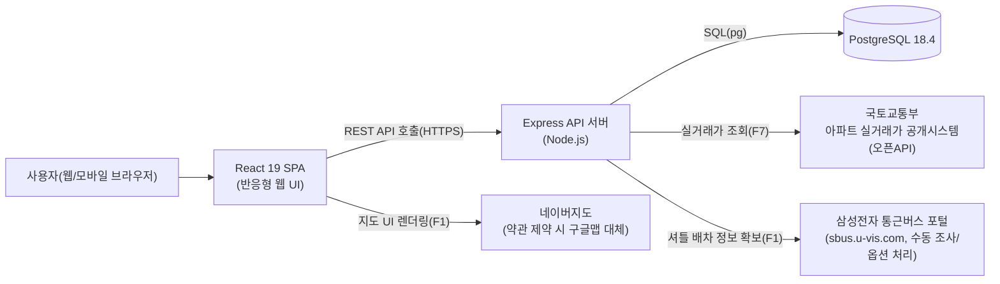
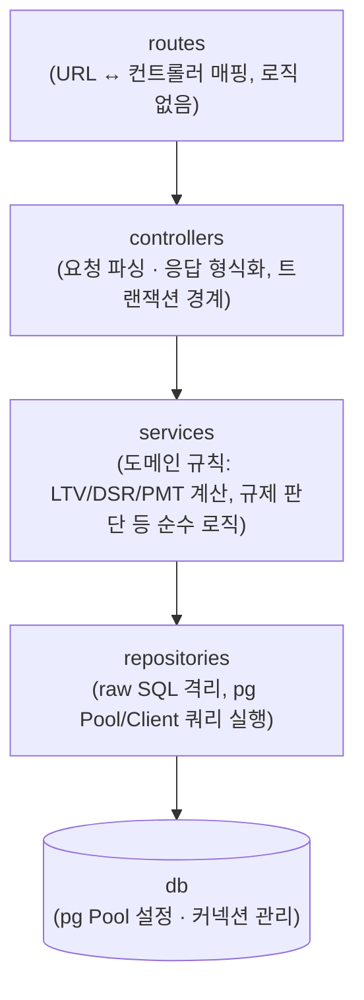
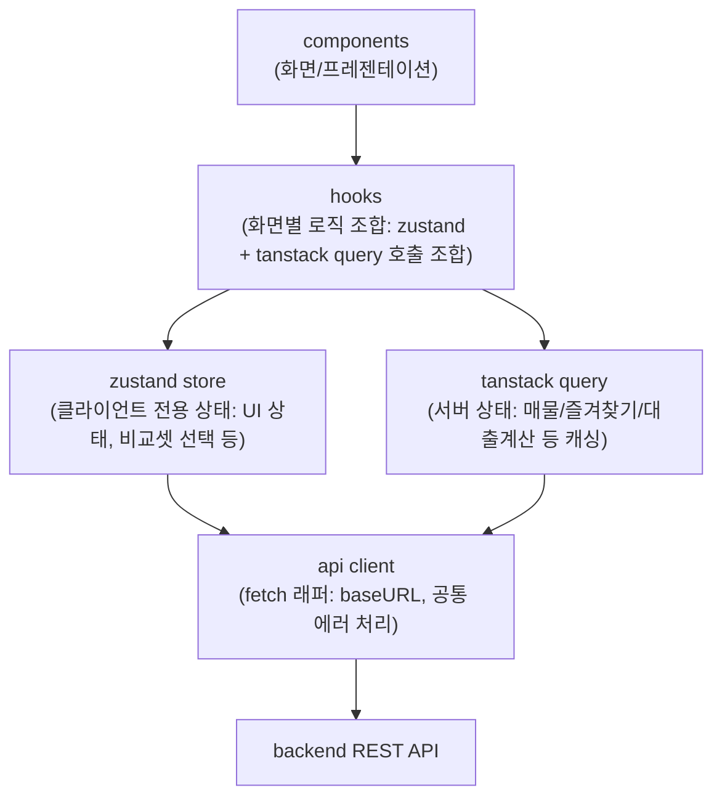
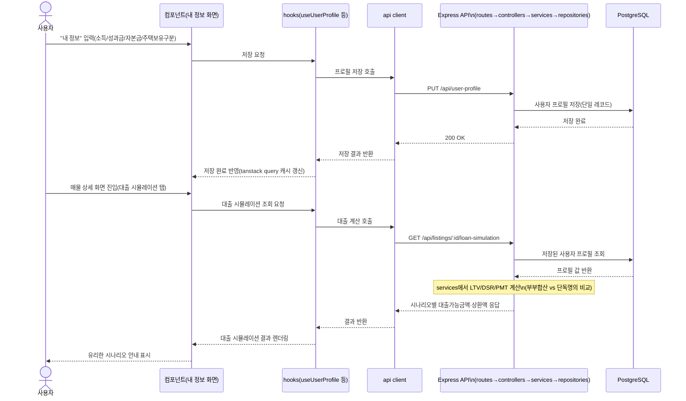

# housing 기술 아키텍처 다이어그램

- 버전: v0.5
- 최종 수정일: 2026-07-06
- 참조 문서: [1-domain-definition.md](./1-domain-definition.md) (v0.6), [2-prd.md](./2-prd.md) (v0.5), [3-user-scenario.md](./3-user-scenario.md) (v0.4), [4-project-principle.md](./4-project-principle.md) (v0.4)
- 버전 관리 규칙: 본 문서를 수정할 때마다 상단 버전(v0.1 → v0.2 …)과 최종 수정일을 함께 갱신한다. 과거 버전 이력은 별도 변경이력 절에 누적 기록한다.

## 변경 이력

| 버전 | 날짜 | 변경 내용 |
|---|---|---|
| v0.1 | 2026-07-05 | 최초 초안 작성 (전체 시스템 구성도, 백엔드/프론트엔드 레이어 다이어그램, F6 핵심 흐름 시퀀스 다이어그램) |
| v0.2 | 2026-07-05 | 정합성 검토 반영: 참조 문서 버전 갱신(PRD v0.3, 사용자 시나리오 v0.2, 구조원칙 v0.2) / 국토교통부 실거래가 출처 표기를 "국토교통부 아파트 실거래가 공개시스템(오픈API)"으로 통일 |
| v0.3 | 2026-07-05 | 참조 문서 버전 재갱신(도메인 v0.5, PRD v0.4, 사용자 시나리오 v0.3, 구조원칙 v0.3) |
| v0.4 | 2026-07-05 | 참조 문서 버전 재갱신(도메인 v0.6, PRD v0.5, 사용자 시나리오 v0.4, 구조원칙 v0.4) |
| v0.5 | 2026-07-06 | 로컬 개발 환경에 실제 설치된 버전 확인 결과를 반영해 대상 DB 버전을 PostgreSQL 17 → 18.4로 정정(§1 시스템 구성도) |

---

## 0. 문서 목적 및 범위

본 문서는 1~4번 문서에서 확정된 기술 스택과 구조 원칙을 mermaid 다이어그램으로 시각화한다. `4-project-principle.md` §1의 오버엔지니어링 금지 원칙을 그대로 따라, 이 앱이 **인증 없는 개인용 단일 사용자 웹앱(F1~F7)** 임을 전제로 최대한 단순한 구조만 그린다. 마이크로서비스, 다중 서버, 별도 캐시 레이어, 메시지 큐 등은 실제로 사용하지 않으므로 다이어그램에도 포함하지 않는다.

이 문서는 DB 스키마 전체와 API 명세 전체를 다루지 않는다(범위 밖). 상세 내용은 `4-project-principle.md`와 후속 `docs/7-execution-plan.md`를 참조한다.

---

## 1. 전체 시스템 구성도

브라우저에서 동작하는 React SPA가 Express API 서버 하나와 통신하고, 이 서버가 PostgreSQL 18.4 및 외부 데이터 소스(국토교통부 실거래가 API, 지도, 삼성전자 셔틀 포털)와 연동하는 가장 단순한 형태의 구성이다. 별도 앱 서버 분리, 캐시 서버, 큐 없이 서버 한 대가 모든 API를 처리한다.

---

## 2. 백엔드 레이어 다이어그램

`4-project-principle.md` §2.3에서 정의한 `routes → controllers → services → repositories → db` 단방향 의존 구조를 그대로 표현한다. SQL 문자열은 `repositories` 계층에만 존재하며, `services`는 순수 계산 로직(LTV/DSR/PMT 등)만 담당해 DB를 알지 못한다.

---

## 3. 프론트엔드 레이어 다이어그램

`4-project-principle.md` §2.2에서 정의한 `components → hooks → (zustand / tanstack query) → api client → backend` 의존 방향을 표현한다. zustand는 서버에 없는 순수 클라이언트 상태(필터 UI, 비교셋 선택 등)만 담당하고, tanstack query는 서버 데이터(매물/즐겨찾기/대출계산 등)의 fetch·캐싱을 전담하며, 실제 HTTP 호출은 api client 계층에만 존재한다.

---

## 4. 핵심 유스케이스 흐름 - F6 대출 시뮬레이션

가장 대표적인 흐름 하나만 표현한다: 사용자가 "내 정보"(재무 프로필)를 입력해 저장하고, 이후 매물 상세 화면에서 대출 시뮬레이션 결과를 조회하는 흐름이다(도메인 §3.6, PRD F6, 시나리오 6-1 기준). 다른 유스케이스(F1~F5, F7)는 단순화 지시에 따라 생략한다.

---

## 5. 범위 밖(Out of Scope) 명시

본 문서는 다이어그램과 최소 설명만을 다룬다. DB 스키마 전체, API 명세 전체, UI 와이어프레임/목업, 실제 코드 구현은 포함하지 않으며 `4-project-principle.md`와 후속 `docs/7-execution-plan.md`, `swagger/swagger.json`에서 다룬다. F1~F5·F7의 개별 시퀀스 다이어그램은 오버엔지니어링 금지 원칙에 따라 이번 버전에서 그리지 않는다.
