# housing ERD (Entity-Relationship Diagram)

- 버전: v0.9
- 최종 수정일: 2026-08-17
- 참조 문서: [1-domain-definition.md](./1-domain-definition.md) (v0.10), [2-prd.md](./2-prd.md) (v0.6), [4-project-principle.md](./4-project-principle.md) (v0.5)
- 버전 관리 규칙: 본 문서를 수정할 때마다 상단 버전(v0.1 → v0.2 …)과 최종 수정일을 함께 갱신한다. 과거 버전 이력은 별도 변경이력 절에 누적 기록한다.

## 변경 이력

| 버전 | 날짜 | 변경 내용 |
|---|---|---|
| v0.1 | 2026-07-05 | 최초 초안 작성 (실제 영구 저장 테이블 6개에 대한 ERD, "대출 시나리오"는 비영속 계산 결과임을 명시) |
| v0.2 | 2026-07-05 | `comparison_set_listings`에 (comparison_set_id, listing_id) UNIQUE 제약 추가(동일 매물 중복 포함 방지, database/schema.sql과 정합), 참조 문서 버전 갱신 |
| v0.3 | 2026-07-05 | 실행계획 수립 중 발견된 공백 정정: `listings.nearest_shuttle_stop_name`/`nearest_shuttle_stop_distance`/`shuttle_commute_minutes`를 nullable로 변경(셔틀 배차 정보 미확보 매물의 "정보 없음" 표시를 스키마가 실제로 지원하도록 함) |
| v0.4 | 2026-07-05 | **구조 변경(도메인 v0.8 반영)**: 단일 `listings` 테이블을 `apartment_complexes`(단지: 위치·연식·리모델링·재건축·주변 재개발·규제지역·토허구역·셔틀·입지 속성)와 `listings`(매물: complex_id FK·매매가·전용면적)로 분리. 즐겨찾기를 `favorite_complexes`/`favorite_listings`로 이원화. 비교셋에 `target_type` 컬럼 추가 및 `comparison_set_complexes` 신설(기존 `comparison_set_listings`는 유지). `price_history.listing_id`를 `price_history.complex_id`로 재소속(매매가 변동 이력은 단지 단위 관리). "단지 시세"가 `listings.sale_price`의 조회 시점 집계값(비영속)임을 §1에 추가 명시 |
| v0.5 | 2026-07-05 | 참조 문서 버전 갱신(PRD v0.6, 프로젝트 구조 원칙 v0.5) |
| v0.6 | 2026-07-06 | 로컬 개발 환경에 실제 설치된 버전 확인 결과를 반영해 대상 DB 버전을 PostgreSQL 17 → 18.4로 정정 |
| v0.7 | 2026-07-10 | 실데이터 연동 반영(도메인 v0.10): `apartment_complexes`에 `lawd_cd`/`molit_apt_name` 추가(국토부 실거래가 API 실시간 조회 매핑용, 둘 다 nullable). 학군 정보 산출을 위한 `elementary_schools` 테이블 신설(FK 관계 없는 독립 참조 테이블, data.go.kr 정적 데이터셋 임포트 결과). `price_history`는 매핑 정보가 없는 단지의 폴백 데이터로 역할이 한정됨을 명시 |
| v0.8 | 2026-08-17 | 문서 누락 보완: `database/schema.sql`(테이블 11번)과 마이그레이션 파일에는 이미 존재하던 `regional_listing_cache`(경기남부+서울 실시간(배치 캐싱) 매물 검색용 캐시 테이블, 도메인 v0.14 후속)를 ERD와 테이블별 비고에 추가. FK 관계 없는 독립 테이블이며, 사용자가 검색 결과를 선택하는 시점에 `apartment_complexes`/`listings`로 승격(upsert)되는 구조임을 명시 |
| v0.9 | 2026-08-17 | 배정학교 탭 신설 반영(도메인 v0.19): `elementary_schools`에 `school_level varchar(20) NOT NULL DEFAULT '초등학교'` 컬럼 및 인덱스 추가('초등학교'/'중학교'). 시드 스크립트가 초·중학교를 함께 적재하며, 테이블명은 기존 코드 호환을 위해 `elementary_schools`를 유지한다(초등 전용이 아니게 되었음을 비고에 명시) |

---

## 0. 문서 목적 및 범위

본 문서는 도메인 정의서 §4(주요 엔티티와 속성)와 PRD §7(데이터 요구사항)을 근거로, `housing` 서비스가 PostgreSQL 18.4에 실제로 영구 저장해야 하는 테이블만을 mermaid `erDiagram`으로 표현한다. `4-project-principle.md` §1의 오버엔지니어링 금지 원칙에 따라, 저장할 이유가 없는 데이터는 테이블로 만들지 않는다(§2 참조). DB 스키마 상세 DDL, API 명세, 마이그레이션 파일은 본 문서 범위가 아니며 후속 `docs/7-execution-plan.md`에서 다룬다.

---

## 1. 비영속(계산값) 데이터 — 테이블로 만들지 않는 것

도메인 정의서 §4는 아파트 단지/매물/사용자/즐겨찾기/비교셋/대출 시나리오/매매가 변동 이력을 나열하지만, 이 중 다음 두 가지는 별도의 영구 저장 테이블/컬럼으로 만들지 않는다.

### 1.1 "대출 시나리오"는 테이블이 아니다

1. 도메인 §4.3(사용자): 대출 시뮬레이션 입력값(명의 구성, 개인/부부 소득·성과금·자본금·주택 보유 현황)은 "앱 최초 진입 시 수집하여 **프로필에 영구 저장**"한다고 명시되어 있다. 즉 실제로 저장되는 곳은 사용자 프로필(`user_profiles`) 테이블이다.
2. 도메인 §4.6 "대출 시나리오" 표에 있는 "매물 ID"는 `listings` 테이블에 이미 저장된 값(매매가는 `listings`, 규제 정보는 소속 `apartment_complexes`)이고, "산출 결과(최대 대출가능금액, 상환액 등)"는 이 값들 + 저장된 사용자 프로필을 조합해 **요청 시점에 결정론적으로 계산**되는 값이다(도메인 §5.1~§5.4는 순수 입력→출력 계산 로직이며 별도 상태를 갖지 않는다).
3. 따라서 대출 시나리오 결과를 별도 테이블에 저장하면, 사용자 프로필이나 매물 가격이 바뀔 때마다 저장된 계산 결과와 실제 값이 어긋나는 정합성 문제만 생기고 얻는 이점이 없다(4-project-principle.md §1 오버엔지니어링 금지, §2.3 "services는 SQL을 몰라야 한다"는 순수 계산 로직 원칙과도 일치).

### 1.2 "단지 시세"는 테이블/컬럼이 아니다 (도메인 v0.8 추가)

도메인 §2, §5.5에 따르면 "단지 시세(Complex Price Range)"는 단지 비교 시 사용되는 대표 시세로, 해당 단지에 속한 매물들의 `listings.sale_price`를 **조회 시점에 MIN/MAX(필요 시 AVG)로 집계**한 값이다. 별도 컬럼(예: `apartment_complexes.min_price`)이나 별도 테이블로 저장하지 않는다 — 매물이 추가/삭제/가격변경될 때마다 캐시값을 동기화해야 하는 부담만 생기고, `listings` 원본 조회로 언제든 즉시 계산 가능하기 때문이다(오버엔지니어링 금지). 해당 단지에 매물이 0건이면 서비스 레이어에서 "매물 없음"으로 처리한다.

**결론**: 아래 ERD에는 대출 시나리오 테이블과 단지 시세 테이블/컬럼을 그리지 않는다. 대출 시나리오는 `user_profiles` + `listings` + `apartment_complexes` 값을 조합해 API 응답 시점에 백엔드 `services` 계층에서 계산되는 **비영속(non-persistent) 데이터**이며, 단지 시세는 `listings.sale_price`를 조회 시점에 집계하는 **비영속 계산값**이다.

---

## 2. 아파트 단지/매물 분리 및 중간 테이블 추가 근거 (도메인 v0.8)

- **아파트 단지(apartment_complexes) / 매물(listings) 분리**: 도메인 §1, §2, §4.1~§4.2는 연식·리모델링·재건축·주변 재개발·규제지역·토허구역·셔틀·입지 속성이 전부 "단지" 단위 속성이고, 매매가·전용면적만 "매물(개별 판매 건)" 단위 속성임을 명시한다. 하나의 단지는 여러 매물을 가질 수 있는 1:N 관계이므로, 단지 속성을 매물 테이블에 중복 저장하지 않고 `apartment_complexes`로 분리한다(정규화, 중복 저장 방지 — 도메인 §4.2 "매물 자체에 별도로 저장하지 않는다").
- **즐겨찾기 이원화**: 도메인 §4.4는 단지 즐겨찾기와 매물 즐겨찾기가 서로 독립된 목록임을 명시하므로, 기존 `favorites`를 `favorite_listings`로 개명하고 `favorite_complexes`를 신설한다.
- **비교셋 이원화**: 도메인 §4.5는 비교셋이 "단지 비교"/"매물 비교" 중 하나의 유형을 가지며 대상 유형이 혼합되지 않음을 명시한다. `comparison_sets.target_type`으로 유형을 저장하고, 유형별 대상은 `comparison_set_complexes`/`comparison_set_listings`(다대다 매핑 테이블)로 각각 관리한다. **target_type과 실제로 어느 매핑 테이블에 행이 들어가는지의 정합성(예: target_type='complex'인데 comparison_set_listings에 행이 들어가는 경우 방지)은 DB 트리거가 아닌 애플리케이션(services) 레벨에서 검증한다**(오버엔지니어링 금지 — 4-project-principle.md §1).
- **매매가 변동 이력 재소속**: 도메인 §2, §4.7은 실거래가 데이터가 "단지+거래건" 단위로 공개되며 특정 판매 건 하나에 종속되지 않음을 명시하므로, `price_history.listing_id`를 `price_history.complex_id`로 변경한다.
- 다대다 관계는 배열 컬럼이 아닌 별도의 매핑(중간) 테이블로 표현해야 컬럼별 조회·제약조건(중복 방지 등) 관리가 가능하다. 비교셋당 2~5개 대상이어야 한다는 제약(PRD F3 인수조건)은 DB 레벨이 아닌 애플리케이션(services) 레벨에서 검증한다.

---

## 3. ERD 전체

```mermaid
erDiagram
    apartment_complexes ||--o{ listings : "단지에 속한 매물"
    user_profiles ||--o{ favorite_complexes : "단지 즐겨찾기 등록"
    apartment_complexes ||--o{ favorite_complexes : "즐겨찾기 대상(단지)"
    user_profiles ||--o{ favorite_listings : "매물 즐겨찾기 등록"
    listings ||--o{ favorite_listings : "즐겨찾기 대상(매물)"
    user_profiles ||--o{ comparison_sets : "비교셋 생성"
    comparison_sets ||--o{ comparison_set_complexes : "포함 단지 매핑(2~5개, 앱 레벨 검증)"
    apartment_complexes ||--o{ comparison_set_complexes : "비교셋에 포함됨(단지)"
    comparison_sets ||--o{ comparison_set_listings : "포함 매물 매핑(2~5개, 앱 레벨 검증)"
    listings ||--o{ comparison_set_listings : "비교셋에 포함됨(매물)"
    apartment_complexes ||--o{ price_history : "매매가 변동 이력"

    user_profiles {
        integer id PK "고정값 1 (단일 사용자 프로필, 여러 행 생성 안 함)"
        varchar workplace "근무지 (화성/평택 캠퍼스 중 선택)"
        varchar ownership_structure "명의 구성 (단독/부부합산)"
        integer annual_income "연소득(명의자별, 만원)"
        integer annual_bonus "성과금(명의자별 연 환산, 만원, 기본값 0)"
        integer available_capital "자본금(가용 현금, 만원)"
        varchar housing_ownership_tier "세대 주택 보유 구분 (무주택/1주택/다주택)"
        boolean is_first_time_buyer "생애최초 해당 여부 (무주택일 때만 true 가능)"
    }

    apartment_complexes {
        integer id PK
        varchar complex_name "단지명"
        decimal latitude "위도"
        decimal longitude "경도"
        varchar address "주소"
        integer completion_year "준공년도(1970~조회년도)"
        varchar remodeling_status "리모델링 추진현황(해당없음/추진중/완료, 기본값 해당없음)"
        integer remodeling_completion_year "리모델링 완료 연도(추진현황이 완료일 때만 값 존재, null 허용)"
        varchar reconstruction_status "재건축 추진현황(해당없음/추진위원회/조합설립인가/사업시행인가/관리처분인가/이주철거중/착공, 기본값 해당없음)"
        text nearby_redevelopment_info "주변 재개발 정보(null 허용)"
        boolean is_regulated_area "규제지역 여부(기본값 false)"
        boolean is_land_transaction_permission_zone "토지거래허가구역 여부(기본값 false, 미고시 시 null)"
        varchar nearest_shuttle_stop_name "최근접 셔틀 정류장명(배차정보 미확보 시 null)"
        integer nearest_shuttle_stop_distance "최근접 셔틀 정류장까지 거리(m, null 허용)"
        integer shuttle_commute_minutes "셔틀 통근시간(분, null 허용)"
        jsonb locality_attributes "입지 속성(교통/상권/학군/강남접근성/유흥·공원/개발호재/주변일자리, null 허용)"
        varchar lawd_cd "법정동코드 앞5자리(국토부 실거래가 API 조회용, null 허용)"
        varchar molit_apt_name "국토부 실거래가 API상 단지명(자체 표기와 다를 수 있어 별도 보관, null 허용)"
    }

    elementary_schools {
        integer id PK
        varchar school_name "학교명"
        varchar school_level "학교급(초등학교/중학교, 기본 초등학교)"
        decimal latitude "위도"
        decimal longitude "경도"
        varchar address "주소"
    }
    %% 전국초중등학교위치표준데이터(data.go.kr, 정적 데이터셋) 임포트 결과. 단지와 FK 관계 없음 — 조회 시점에 좌표로 최근접 학교를 계산(§3.7.1, 배정학교 탭은 도메인 v0.19)

    listings {
        integer id PK
        integer complex_id FK "apartment_complexes.id 참조"
        integer sale_price "매매가(만원, 70000~150000)"
        decimal exclusive_area "전용면적(m^2, > 0)"
    }

    favorite_complexes {
        integer id PK
        integer user_profile_id FK "user_profiles.id 참조"
        integer complex_id FK "apartment_complexes.id 참조"
        timestamp registered_at "등록일시"
    }
    %% (user_profile_id, complex_id) UNIQUE 제약: 중복 즐겨찾기 방지

    favorite_listings {
        integer id PK
        integer user_profile_id FK "user_profiles.id 참조"
        integer listing_id FK "listings.id 참조"
        timestamp registered_at "등록일시"
    }
    %% (user_profile_id, listing_id) UNIQUE 제약: 중복 즐겨찾기 방지

    comparison_sets {
        integer id PK
        integer user_profile_id FK "user_profiles.id 참조"
        varchar target_type "비교 대상 유형(complex/listing) — 하나의 비교셋 내 대상은 동일 유형"
        timestamp created_at "생성일시"
    }

    comparison_set_complexes {
        integer id PK
        integer comparison_set_id FK "comparison_sets.id 참조"
        integer complex_id FK "apartment_complexes.id 참조"
    }
    %% (comparison_set_id, complex_id) UNIQUE 제약: 동일 단지 중복 포함 방지

    comparison_set_listings {
        integer id PK
        integer comparison_set_id FK "comparison_sets.id 참조"
        integer listing_id FK "listings.id 참조"
    }
    %% (comparison_set_id, listing_id) UNIQUE 제약: 동일 매물 중복 포함 방지

    price_history {
        integer id PK
        integer complex_id FK "apartment_complexes.id 참조"
        date transaction_date "거래일자(오늘 이하)"
        integer transaction_price "거래금액(만원)"
        varchar data_source "데이터 출처(고정값: 국토교통부 아파트 실거래가 공개시스템)"
        varchar lookup_period_type "조회 기간 구분(최근 20년 / 최초거래 이후)"
    }
    %% apartment_complexes.lawd_cd/molit_apt_name이 모두 있는 단지는 이 테이블 대신 국토부 API를 매 요청마다 실시간 조회(fetch-through)하며, 조회 기간은 항상 "최근 3년"이다(§3.7). 이 테이블은 매핑 정보가 없는 단지의 폴백 데이터로만 쓰인다.

    regional_listing_cache {
        integer id PK
        varchar lawd_cd "법정동코드 앞 5자리(target-regions.js 기준)"
        varchar kapt_code "국토부 공동주택 단지목록 kaptCode(매칭 실패 시 null)"
        varchar complex_name "단지명"
        varchar address "실거래가 API 지번/도로명 주소(null 허용)"
        numeric exclusive_area "전용면적 m2"
        integer sale_price "최근 실거래가(만원)"
        date transaction_date "대표 거래일자"
        integer household_count "세대수(null 허용)"
        numeric latitude "위도(null 허용)"
        numeric longitude "경도(null 허용)"
        timestamp collected_at "수집 시각"
    }
    %% 배치 수집기(collect-regional-listings.js)가 채우는 실시간 지역 매물 검색용 캐시. FK 관계 없는 독립 테이블이며, (lawd_cd, complex_name, exclusive_area) UNIQUE. 사용자가 검색 결과를 선택하면 apartment_complexes/listings로 승격(upsert)된다.
```

---

## 4. 테이블별 비고

| 테이블 | 대응 도메인 절 | 비고 |
|---|---|---|
| `user_profiles` | §4.3 | 인증 체계가 없는 단일 사용자 앱이므로 항상 1행만 존재한다. PK는 고정값(예: `id = 1`)으로 취급하고 신규 행을 추가로 생성하지 않는다(4-project-principle.md §1.5 "단일 사용자 전제의 단순화" 반영). |
| `apartment_complexes` | §4.1 | 도메인 v0.8에서 신설. 단지명·위치·연식·리모델링·재건축·주변 재개발·규제지역·토허구역·셔틀·입지 속성을 보유한다. `locality_attributes`는 `jsonb` 타입으로 저장한다. `lawd_cd`/`molit_apt_name`은 국토부 실거래가 API 실시간 조회를 위한 매핑 컬럼으로, 둘 다 존재하는 단지만 fetch-through 대상이 된다(도메인 §3.7, 둘 다 nullable). |
| `listings` | §4.2 | 도메인 v0.8에서 단지 속성이 전부 `apartment_complexes`로 이동하고, `complex_id`(NOT NULL FK) + 매매가 + 전용면적만 남았다. 반드시 하나의 단지에 속한다(도메인 §4.2 "단지 FK 필수"). |
| `favorite_complexes` | §4.4 | 도메인 v0.8 신설. `(user_profile_id, complex_id)` 조합 유니크 제약으로 중복 즐겨찾기를 막는다. |
| `favorite_listings` | §4.4 | 기존 `favorites`를 개명. `(user_profile_id, listing_id)` 조합 유니크 제약 유지. |
| `comparison_sets` | §4.5 | `target_type` 컬럼(complex/listing)을 도메인 v0.8에서 추가. 포함 대상 목록은 유형에 따라 `comparison_set_complexes` 또는 `comparison_set_listings`로 분리한다. target_type과 실제 사용된 매핑 테이블 간 정합성은 DB가 아닌 서비스 레이어에서 강제한다(§2 참조, 트리거 도입 안 함). |
| `comparison_set_complexes` | §4.5(도메인 v0.8 신설) | 단지 비교용 N:M 매핑 테이블. `(comparison_set_id, complex_id)` UNIQUE 제약으로 동일 단지 중복 포함을 DB 레벨에서 방지한다. |
| `comparison_set_listings` | §4.5(추가 설계) | 매물 비교용 N:M 매핑 테이블. 하나의 비교셋에 2~5개 대상이 포함되어야 하는 제약은 서비스 레이어에서 검증한다. `(comparison_set_id, listing_id)` UNIQUE 제약으로 동일 매물의 중복 포함은 DB 레벨에서 방지하며, 프론트엔드는 이 제약 위반 시 "중복입니다" 팝업을 표시한다(도메인 §3.3/§4.5, PRD F3). |
| `price_history` | §4.7 | 도메인 v0.8에서 `listing_id` → `complex_id`로 재소속(단지별로 다건의 거래 이력이 쌓이는 1:N 구조). `lookup_period_type`은 20년 이상 데이터 보유 여부에 따라 "최근 20년" 또는 "최초거래 이후" 값을 갖는다(도메인 §4.7, §3.7). `apartment_complexes.lawd_cd`/`molit_apt_name`이 모두 있는 단지는 이 테이블을 쓰지 않고 국토부 API를 실시간 조회(fetch-through)하므로, 이 테이블은 매핑 정보가 없는 단지의 폴백 데이터로만 채운다. |
| `elementary_schools` | §3.7.1(도메인 v0.10 신설), 배정학교 탭(도메인 v0.19) | 전국초중등학교위치표준데이터(data.go.kr, 정적 데이터셋) 임포트 결과. 다른 테이블과 FK 관계 없이 독립적으로 존재하며, 조회 시점에 단지 좌표와의 haversine 거리 계산으로 최근접 학교를 산정하는 데 쓰인다(학군 입지 축은 700m 반경 초등학교, 배정학교 탭은 3km 반경 초·중학교). 도메인 v0.19부터 `school_level`('초등학교'/'중학교')로 중학교도 함께 적재하므로 테이블명과 달리 초등 전용이 아니다(기존 코드 호환을 위해 테이블명 유지). 2026-08-17 기준 data.go.kr API 활용신청 미승인이라 데이터가 비어 있다(승인 후 시드 스크립트 재실행 필요). |
| `regional_listing_cache` | 도메인 v0.14 후속(실시간 지역 매물 검색) | 국토교통부 실거래가 API(지역+월 단위)를 배치 수집기(`backend/scripts/collect-regional-listings.js`, `npm run collect-listings`)로 주기 수집해 캐싱하는 테이블. `apartment_complexes`/`listings`와 별개의 독립 테이블(FK 없음)이며, 실제 "매물 호가"가 아닌 "최근 실거래가"를 시세 근사치로 사용한다. `GET /api/listings/live-search`가 이 테이블을 조회하고, 사용자가 결과를 선택(`POST /api/listings/live-search/select`)하는 시점에 해당 행이 `apartment_complexes`/`listings`로 승격(upsert)된다. `(lawd_cd, complex_name, exclusive_area)` UNIQUE로 재수집 시 중복을 방지한다. |

---

## 5. 범위 밖(Out of Scope) 명시

본 문서는 ERD와 최소 설명만 다룬다. 테이블별 전체 DDL(제약조건 SQL, 인덱스 설계), API 명세, 실제 마이그레이션 파일 코드는 포함하지 않으며 `docs/7-execution-plan.md`에서 후속으로 다룬다. "대출 시나리오"와 "단지 시세"는 위 §1에서 설명한 대로 테이블/컬럼으로 그리지 않는다.
