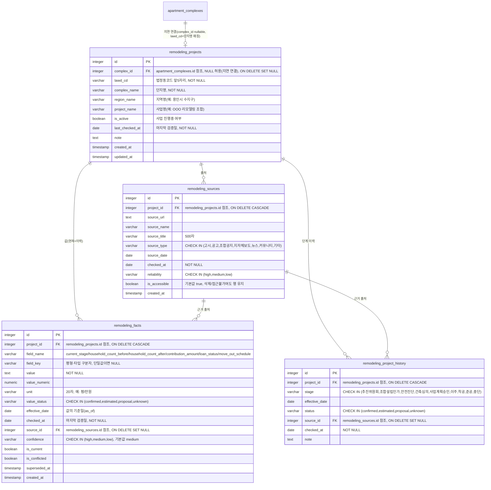

# 리모델링 정보 트랙 구현 계획

- 버전: v0.1
- 최종 수정일: 2026-09-07
- 참조 문서: [1-domain-definition.md](../1-domain-definition.md) (v0.19), [2-prd.md](../2-prd.md) (v0.6) §9, [6-erd.md](../6-erd.md) (v0.10), [7-execution-plan.md](../7-execution-plan.md), [4-project-principle.md](../4-project-principle.md) (v0.9), `database/schema.sql`
- 버전 관리 규칙: 본 문서를 수정할 때마다 상단 버전(v0.1 → v0.2 …)과 최종 수정일을 함께 갱신한다. 과거 버전 이력은 별도 변경이력 절에 누적 기록한다.

## 변경 이력

| 버전 | 날짜 | 변경 내용 |
|---|---|---|
| v0.1 | 2026-09-07 | 최초 작성. 매물 상세 "리모델링" 탭 신설을 위한 데이터 모델·API·프론트엔드·외부 조사(재조사) 전략을 확정하고 문서화 |

---

## 배경/목적

현재 `apartment_complexes.remodeling_status`(해당없음/추진중/완료) + `remodeling_completion_year` 두 컬럼만으로는 리모델링 사업 단계·이력·세대수 변화·분담금·대출 상태를 표현할 수 없다. 리모델링은 단일 공식 API가 없어(`docs/2-prd.md` §9 리스크 "단지 기본정보 데이터 출처 미확정") 수동 리서치에 의존하므로, 값마다 출처·기준일·마지막 검증일·상태·신뢰도를 추적해 향후 "`checked_at`이 30일 지난 항목만 재조사"가 가능한 데이터 계층이 필요하다.

- **조사 대상**: 2026-09-07 기준 용인시 수지구(`lawd_cd` 41465)·수원시 영통구(41117) 리모델링 추진 아파트.
- **설계 제약**: 기존 실거래가(MOLIT fetch-through)와 지도 기능은 새로 구현하지 않고 반드시 재사용한다.
- **승인된 결정**
  1. 노출 위치는 매물 상세 "리모델링" 탭 신설
  2. 실제 단지 데이터 수집은 구현 후 별도 조사 단계로 분리
  3. 단지 연결은 `lawd_cd`+단지명 매칭 + `complex_id` 지연 연결(nullable FK)

---

## 1. 현재 구조 분석 결과

| 영역 | 확인 결과(경로) |
|---|---|
| 데이터 모델/마이그레이션 | `database/schema.sql`은 로컬 초기구축용 단일 SQL 파일(마이그레이션 대체 아님). 운영 스키마 변경은 `backend/src/db/migrations/*.js`(node-pg-migrate, `npm run migrate`)로 관리하며, 마이그레이션 파일은 `pgm.sql()` raw SQL만 사용한다(CommonJS `exports.xxx =` 형태). 파일명은 타임스탬프 접두(예: `1786940000000_add-school-level-to-elementary-schools.js`) |
| 단지/매물 관계 | `apartment_complexes` ↔ `listings` 1:N. 단지 속성(연식·리모델링·재건축·규제 등)을 매물 테이블에 중복 저장하지 않는다(`docs/4-project-principle.md` §3) |
| 실거래가(매매) | `backend/src/services/listings.service.js`의 `getPriceHistory`가 소속 단지에 `lawd_cd`+`molit_apt_name`이 모두 있으면 `backend/src/services/molit-price-history.service.js`로 국토부 API를 실시간 조회(최근 36개월, fetch-through), 없으면 `price_history` 테이블 폴백(로컬 20년/최초거래이후) |
| 실거래가(전세) | `backend/src/services/jeonse-history.service.js`가 동일한 `molit-price-history.service.js` 계열 조회 로직을 재사용해 전세가율을 계산 |
| 지도/마커 | `frontend/src/shared/map/`(`MapView.tsx`, `mapAdapter.ts`의 `MapPoint{id,lat,lng}`, `naverMapAdapter.ts`). `ListingSearchScreen`이 `mapPoints`를 주입 |
| 단지 선택(승격) | 실시간 탐색(`regional_listing_cache`) → `POST /api/listings/live-search/select` → `regional-listings.service.selectCacheEntry`가 주소 기준 `findOrCreateComplex` 후 `listings` 생성. 즉 `apartment_complexes` 행은 사용자가 실시간 탐색 결과를 선택할 때 비로소 생성될 수 있다 |
| 상세 탭 구조 | `frontend/src/features/listing-detail/components/ListingDetailTabs.tsx`의 `TABS` 배열(현재 규제/대출·입지정보·대출시뮬레이션·매매가변동이력·전세가변동이력·배정학교 6개) + `TabErrorBoundary`(`shared/components/TabErrorBoundary`)로 개별 탭 오류를 격리. 각 탭은 `features/listing-detail/<name>/{components,hooks,types.ts}` 3층 구조 |
| API 계층 | `routes` → `controller`(숫자 파싱 + 404) → `service` → `repository` (`docs/4-project-principle.md` §2.3) |
| 시드/배치 | `backend/scripts/seed-elementary-schools.js`, `backend/scripts/collect-regional-listings.js`, 설정은 `backend/src/config/target-regions.js`(수지구 41465·영통구 41117 이미 등록) |

---

## 2. 재사용 가능한 기존 코드 (신규 구현 금지 대상)

- `backend/src/services/molit-price-history.service.js` / `listings.service.js`의 `getPriceHistory` — 국토부 실거래가 fetch-through 로직 그대로 사용
- 프론트엔드 `useListingPriceHistory` 계열 훅 — 실거래가 최신 항목 조회에 재사용
- `frontend/src/shared/map/*` 전체 — 변경 없음(리모델링 탭은 지도를 새로 그리지 않음)
- `apartment_complexes.lawd_cd`, `apartment_complexes.molit_apt_name` — 단지 매칭 키로 그대로 사용
- `backend/src/config/target-regions.js` — 41465(수지구)·41117(영통구) 이미 등록되어 있어 그대로 사용
- `frontend/src/features/listing-detail/components/ListingDetailTabs.tsx`의 `TABS` 배열 + `TabErrorBoundary` — 신규 탭도 동일 패턴으로 등록
- `frontend/src/shared/components/Badge.tsx` — 확정/추정 배지, "확인 필요" 배지 등에 재사용
- `frontend/src/shared/utils/formatPrice.ts` — 분담금·실거래가 금액 포맷팅에 재사용
- `frontend/src/shared/api/client.ts` — API 호출 계층 그대로 사용
- `listingsRepository`의 매물+소속 단지 join 조회 로직(`findByIdWithComplex` 계열) — 리모델링 조회 시 매물→단지 매핑에 재사용
- `backend/scripts/seed-elementary-schools.js`의 스크립트 골격(옵션 파싱, `pg.Pool` 연결, 배치 upsert 패턴) — `refresh-remodeling-data.js` 작성 시 골격만 참고

---

## 3. 데이터 모델 (DB 변경)

마이그레이션 1개(`backend/src/db/migrations/1788000000000_create-remodeling-tables.js`) + `database/schema.sql` 동기화. 기존 테이블/컬럼은 변경하지 않는다.

**설계 원칙**: 모든 "값"은 `remodeling_facts` 단일 진실원천(Single Source of Truth)에 두고 `remodeling_projects`에는 값을 중복 저장하지 않는다. 따라서 이전 값의 변경 이력은 `is_current=false` 행으로 자동 성립한다.

### 3.1 ERD



### 3.2 제약 조건 요약

| 테이블 | 제약/인덱스 |
|---|---|
| `remodeling_projects` | `UNIQUE (lawd_cd, complex_name)`, `INDEX(complex_id)`, `INDEX(last_checked_at)` |
| `remodeling_sources` | `INDEX(project_id)` |
| `remodeling_facts` | 부분 UNIQUE INDEX `(project_id, field_name, COALESCE(field_key, ''))` WHERE `is_current` — 필드+구분자당 "현재값"은 항상 1건만 존재 |
| `remodeling_project_history` | `UNIQUE (project_id, stage)` — 동일 단계 중복 방지 |

### 3.3 `checked_at`의 의미 (반드시 구분할 것)

`checked_at`은 **"그 사실이 발생한 날짜"가 아니라 "그 정보를 마지막으로 검증한 날짜"**다.

- 예: 사업계획승인일 `effective_date=2025-11-18`(실제 승인이 난 날짜), 마지막 확인일 `checked_at=2026-09-07`(운영자가 그 사실을 최근에 다시 확인한 날짜). 이 둘은 서로 다른 시점이며 혼동해서는 안 된다.
- 분담금도 단일 `contribution_amount` 컬럼으로 두지 않고, `remodeling_facts` 행 하나가 `value`(금액)/`unit`(평형)/`value_status`(확정·추정 등)/`effective_date`(기준일)/`checked_at`(마지막 확인일)/`source_id`(출처)를 각각 독립적으로 추적한다. 평형별로 값이 다르면 `field_key`로 구분한 여러 행이 존재한다.

---

## 4. Backend API 변경

| 구분 | 파일 |
|---|---|
| 설정 | `backend/src/config/remodeling.js` — `STALE_AFTER_DAYS = process.env.REMODELING_STALE_AFTER_DAYS || 30`(설정 변경 가능) |
| Repository | `backend/src/repositories/remodeling.repository.js` |
| Service | `backend/src/services/remodeling.service.js`(조회 조립 + `daysSinceChecked`/`isStale` 파생값 계산), `backend/src/services/remodeling-maintenance.service.js`(재조사 규칙, §6 참조) |
| 기존 파일 수정 | `listings.service.js`/`listings.controller.js`/`listings.routes.js`에 `getRemodeling` 추가 |
| 신규 admin | `backend/src/controllers/remodeling-admin.controller.js`, `backend/src/routes/remodeling-admin.routes.js` |
| 앱 조립 | `backend/src/app.js`(라우트 마운트) |
| 명세 | `backend/swagger/swagger.json` |

### 4.1 `GET /api/listings/:id/remodeling`

매물이 속한 단지의 리모델링 프로젝트 정보를 조회한다. 응답 항목: `currentStage`/`households`/`contributions`/`loanStatus`/`stageHistory`/`priceLink`/`staleAfterDays`. 각 값(fact)에는 `status`·`effectiveDate`·`checkedAt`·`daysSinceChecked`·`isStale`·`isConflicted`·`source{name,url,sourceDate,reliability}`가 포함된다. 프로젝트가 없으면 `hasProject:false`를 반환한다.

`priceLink`는 기존 `getPriceHistory` 결과의 최신 항목을 재사용해 만든 것이며, **새로운 조회 로직이 아니다**(§2 재사용 원칙).

```json
{
  "hasProject": true,
  "project": {
    "complexName": "OOO아파트",
    "regionName": "용인시 수지구",
    "projectName": "OOO아파트 리모델링 조합",
    "isActive": true
  },
  "staleAfterDays": 30,
  "currentStage": {
    "value": "사업계획승인",
    "status": "confirmed",
    "effectiveDate": "2025-11-18",
    "checkedAt": "2026-09-07",
    "daysSinceChecked": 0,
    "isStale": false,
    "isConflicted": false,
    "source": {
      "name": "용인시청 고시",
      "url": "https://example.go.kr/notice/123",
      "sourceDate": "2025-11-18",
      "reliability": "high"
    }
  },
  "households": {
    "before": { "value": 1200, "unit": "세대", "status": "confirmed", "effectiveDate": "2024-03-01", "checkedAt": "2026-08-01", "daysSinceChecked": 37, "isStale": true, "isConflicted": false, "source": { "name": "조합 공지", "url": null, "sourceDate": "2024-03-01", "reliability": "medium" } },
    "after": { "value": 1380, "unit": "세대", "status": "estimated", "effectiveDate": "2024-03-01", "checkedAt": "2026-08-01", "daysSinceChecked": 37, "isStale": true, "isConflicted": false, "source": { "name": "조합 공지", "url": null, "sourceDate": "2024-03-01", "reliability": "medium" } }
  },
  "contributions": [
    { "fieldKey": "전용84", "value": "8500", "unit": "만원", "status": "estimated", "effectiveDate": "2025-06-01", "checkedAt": "2026-09-01", "daysSinceChecked": 6, "isStale": false, "isConflicted": false, "source": { "name": "조합 설명회 자료", "url": null, "sourceDate": "2025-06-01", "reliability": "medium" } }
  ],
  "loanStatus": {
    "value": "이주비 대출 협의중",
    "status": "unknown",
    "effectiveDate": null,
    "checkedAt": "2026-08-20",
    "daysSinceChecked": 18,
    "isStale": false,
    "isConflicted": false,
    "source": null
  },
  "stageHistory": [
    { "stage": "추진위원회", "effectiveDate": "2021-05-10", "status": "confirmed", "checkedAt": "2026-09-01" },
    { "stage": "조합설립인가", "effectiveDate": "2023-02-14", "status": "confirmed", "checkedAt": "2026-09-01" },
    { "stage": "사업계획승인", "effectiveDate": "2025-11-18", "status": "confirmed", "checkedAt": "2026-09-07" }
  ],
  "priceLink": {
    "latestTransactionDate": "2026-07-03",
    "latestTransactionPrice": 95000
  }
}
```

프로젝트가 없을 때:

```json
{ "hasProject": false }
```

### 4.2 `GET /api/admin/remodeling/stale?staleAfterDays=30`

`checked_at`이 기준일(기본 30일, 쿼리로 변경 가능)보다 오래된 facts/stageHistory/sources 목록을 반환한다(재조사 대상 특정용, §6 참조).

```json
{
  "staleAfterDays": 30,
  "asOf": "2026-09-07",
  "facts": [
    { "projectId": 12, "complexName": "OOO아파트", "fieldName": "household_count_after", "fieldKey": null, "checkedAt": "2026-08-01", "daysSinceChecked": 37 }
  ],
  "stageHistory": [
    { "projectId": 12, "complexName": "OOO아파트", "stage": "이주", "checkedAt": "2026-07-20", "daysSinceChecked": 49 }
  ],
  "sources": [
    { "sourceId": 33, "projectId": 12, "sourceName": "조합 공지", "checkedAt": "2026-08-01", "daysSinceChecked": 37 }
  ]
}
```

---

## 5. Frontend 변경

- 신규: `frontend/src/features/listing-detail/remodeling/types.ts`
- 신규: `frontend/src/features/listing-detail/remodeling/hooks/useListingRemodeling.ts`
- 신규: `frontend/src/features/listing-detail/remodeling/components/RemodelingTab.tsx` + `.css` + 테스트
- 수정: `frontend/src/features/listing-detail/components/ListingDetailTabs.tsx`(`TABS`에 `remodeling` 추가) + 관련 테스트 2건(`ListingDetailTabs.test.tsx`, `.isolation.test.tsx` 계열)

지도·검색 화면·비교 화면은 변경하지 않는다.

**표시 항목**
- 사업 단계, 단계 이력 타임라인
- 세대수(기존 → 변경, "+증가")
- 분담금(평형별, 확정/추정 배지 — `Badge.tsx` 재사용)
- 대출 상태
- 실거래가 + 분담금 총부담 추정(숫자만, 신규 차트 생성 금지)
- 일반 사용자용으로 반드시 **"정보 기준일 / 마지막 확인일 / 출처"**를 노출

`daysSinceChecked`·`reliability` 같은 내부 상태 값은 전부 사용자에게 노출하지 않는다(운영 판단용 내부 지표).

---

## 6. 외부 조사 / 데이터 수집 방법 (maintenance & update strategy)

**대상 지역과 출처 우선순위**
1. 용인시/수원시 고시·공고, 정비사업 정보몽땅
2. 지자체 보도자료
3. 언론 보도
4. 커뮤니티(`reliability='low'`, `value_status`는 `estimated` 이하만 허용)

**입력 포맷**: `backend/data/remodeling-seed.json`(project → sources → facts → stageHistory 중첩 구조)

**스크립트**: `backend/scripts/refresh-remodeling-data.js`
- `--list [--days 30]`: stale 목록을 JSON으로 출력(재조사 대상 특정용, 이 출력만 보고 재조사 대상을 판단)
- `--apply <file.json>`: 규칙대로 반영하고 변경 전/후 changelog를 출력
- `package.json`에 `remodeling:list` / `remodeling:apply` 스크립트 추가

**재조사 규칙(8개)**
1. `checked_at < CURRENT_DATE - staleAfterDays`인 항목만 재조사 대상으로 삼는다.
2. stale 대상의 `field_name`/`field_key`를 특정한다.
3. 기존 출처보다 같거나 높은 신뢰도(`reliability`)의 최신 공식 출처부터 확인한다.
4. 값이 동일하면 `checked_at`만 갱신한다(touch, 새 행 생성 없음).
5. 값이 변경되면 기존 행을 `is_current=false` + `superseded_at` 설정하고, 새 행을 INSERT한다(supersede).
6. 출처 충돌(동급 신뢰도, 상이한 값)이 발생하면 자동 덮어쓰기를 금지하고 `is_conflicted=true`로 표시한다(conflict).
7. 기존 `confirmed` 값을 `estimated`/`proposal`/`unknown`으로 덮어쓰지 않는다(ignore + conflict 표시).
8. 접근 불가 출처도 삭제하지 않고 `is_accessible=false` + `checked_at`만 갱신한다.

**stale 판정 파생값**: `checked_at`, `days_since_checked`, `is_stale`, `stale_after_days`는 API가 계산해 제공하며, 기본 30일은 `config/remodeling.js`의 설정값으로 변경 가능하다.

**이번 커밋 범위**: 형식 검증용 placeholder 샘플만 `remodeling-seed.json`에 넣고, 실제 수지구·영통구 전수 조사는 별도 단계(§8 구현 순서 11번)로 진행한다.

---

## 7. 수정 예정 파일 목록

**문서**
- `docs/remodeling/implementation-plan.md`(본 문서, 신규)
- `docs/6-erd.md`(갱신)
- `docs/7-execution-plan.md`(갱신)

**DB**
- `backend/src/db/migrations/1788000000000_create-remodeling-tables.js`(신규)
- `database/schema.sql`(동기화, 4개 테이블 섹션 추가)

**Backend 신규**
- `backend/src/config/remodeling.js`
- `backend/src/repositories/remodeling.repository.js`
- `backend/src/services/remodeling.service.js`
- `backend/src/services/remodeling-maintenance.service.js`
- `backend/src/controllers/remodeling-admin.controller.js`
- `backend/src/routes/remodeling-admin.routes.js`
- `backend/data/remodeling-seed.json`
- `backend/scripts/refresh-remodeling-data.js`
- 각 신규 파일에 대응하는 단위/통합 테스트 파일(`backend/tests/unit/*`, `backend/tests/integration/*`)

**Backend 수정**
- `backend/src/services/listings.service.js`(`getRemodeling` 추가)
- `backend/src/controllers/listings.controller.js`(엔드포인트 추가)
- `backend/src/routes/listings.routes.js`(라우트 추가)
- `backend/src/app.js`(admin 라우트 마운트)
- `backend/swagger/swagger.json`(엔드포인트 2개 + 스키마 추가)
- `backend/package.json`(`remodeling:list`/`remodeling:apply` 스크립트 추가)

**Frontend 신규**
- `frontend/src/features/listing-detail/remodeling/types.ts`
- `frontend/src/features/listing-detail/remodeling/hooks/useListingRemodeling.ts`
- `frontend/src/features/listing-detail/remodeling/components/RemodelingTab.tsx`
- `frontend/src/features/listing-detail/remodeling/components/RemodelingTab.css`
- `frontend/src/features/listing-detail/remodeling/components/RemodelingTab.test.tsx`

**Frontend 수정**
- `frontend/src/features/listing-detail/components/ListingDetailTabs.tsx`(`TABS`에 리모델링 탭 추가)
- `frontend/src/features/listing-detail/components/ListingDetailTabs.test.tsx`
- `frontend/src/features/listing-detail/components/ListingDetailTabs.isolation.test.tsx`(또는 동등한 격리 테스트 파일)

---

## 8. 구현 순서

1. 본 문서 작성
2. 마이그레이션 + `database/schema.sql` 동기화
3. `config/remodeling.js` + `remodeling.repository.js`
4. `remodeling.service.js` + 단위테스트
5. `remodeling-maintenance.service.js`(재조사 규칙 4~8) + 단위테스트
6. 조회 API(`GET /api/listings/:id/remodeling`) + 통합테스트 + swagger
7. stale API(`GET /api/admin/remodeling/stale`) + 통합테스트
8. seed json(`remodeling-seed.json`) + `refresh-remodeling-data.js` 스크립트
9. FE `types.ts` → `useListingRemodeling.ts` → `RemodelingTab.tsx` → 탭 등록(`ListingDetailTabs.tsx`) → 테스트
10. 백엔드/프론트 테스트 전체 실행 + 육안 확인
11. (승인 후 별도 단계) 수지구·영통구 실제 조사 → `--apply`로 실데이터 반영

---

## 9. 예상되는 위험 또는 불확실성

- **단지 매칭 실패**: `molit_apt_name` 표기 차이로 `lawd_cd`+단지명 매칭이 실패할 수 있다. 정규화 매칭을 적용하고, 미매칭 시 `hasProject:false`로 처리한다.
- **`complex_id` 지연 연결 backfill**: 실시간 탐색으로 뒤늦게 승격된 단지에 대해 `remodeling_projects.complex_id`를 사후에 연결하는 backfill 작업이 별도로 필요할 수 있다.
- **공식 고시 희소성**: 공식 고시가 드물어 다수 값이 `estimated`로 남을 가능성이 높다. 추정 배지 표시가 필수다.
- **분담금 변동성/평형별 상이**: `field_key` NULL 허용 설계로 단일값과 평형별 값을 함께 흡수하지만, 실제 조사 시 평형 구분 표기가 제각각일 수 있다.
- **`is_conflicted`의 사용자 UX 미정**: 1차는 "확인 필요" 배지로 단순 처리하고, 세부 UX는 후속 결정 사항으로 남긴다.
- **jest 커버리지 80% 임계**: 신규 서비스/repository 전부 단위·통합 테스트로 임계치를 맞춰야 한다.
- **`schema.sql`과 마이그레이션 이중 관리**: 동기화 누락 위험이 있어 마이그레이션 작성 직후 `schema.sql`을 함께 갱신한다.
- **완전 자동 크롤링은 범위 밖**: 조사·판단은 수동 단계(§8의 11번)이며, 본 구현은 데이터 계층과 반영 도구까지만 다룬다.

---

## 검증 방법

1. `npm run migrate` 실행 후 테이블 4개(`remodeling_projects`/`remodeling_sources`/`remodeling_facts`/`remodeling_project_history`) 생성 확인
2. `--apply`로 placeholder 샘플 적재
3. curl로 두 엔드포인트(`GET /api/listings/:id/remodeling`, `GET /api/admin/remodeling/stale`) 확인
4. 동일 값으로 재적용 시 `checked_at`만 변경되는지, 값 변경 시 기존 행 `is_current=false` + 새 행 생성되는지 SQL로 직접 검증
5. `backend`/`frontend` 각각 `npm test` 통과 및 커버리지 80% 이상 확인
6. 브라우저에서 매물 상세의 "리모델링" 탭이 정상 렌더링되는지 육안 확인
